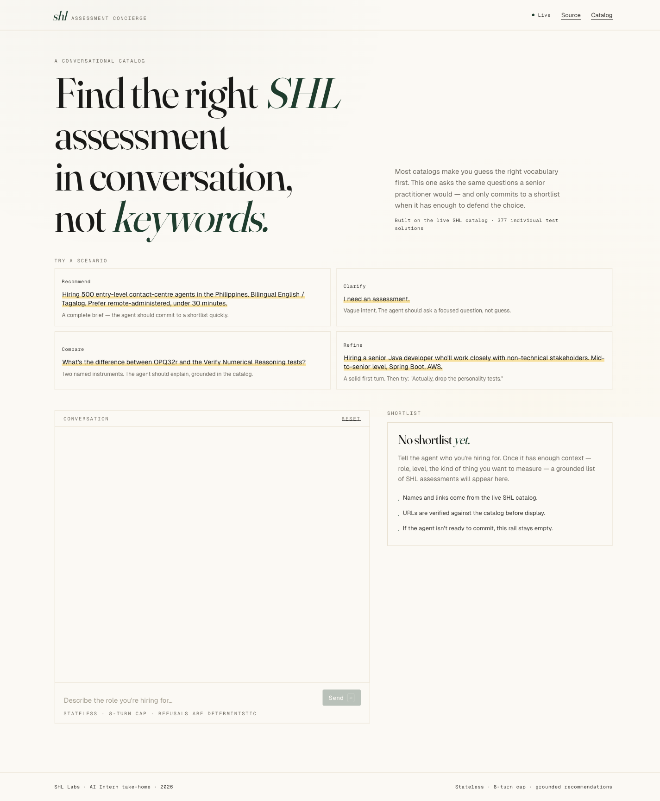
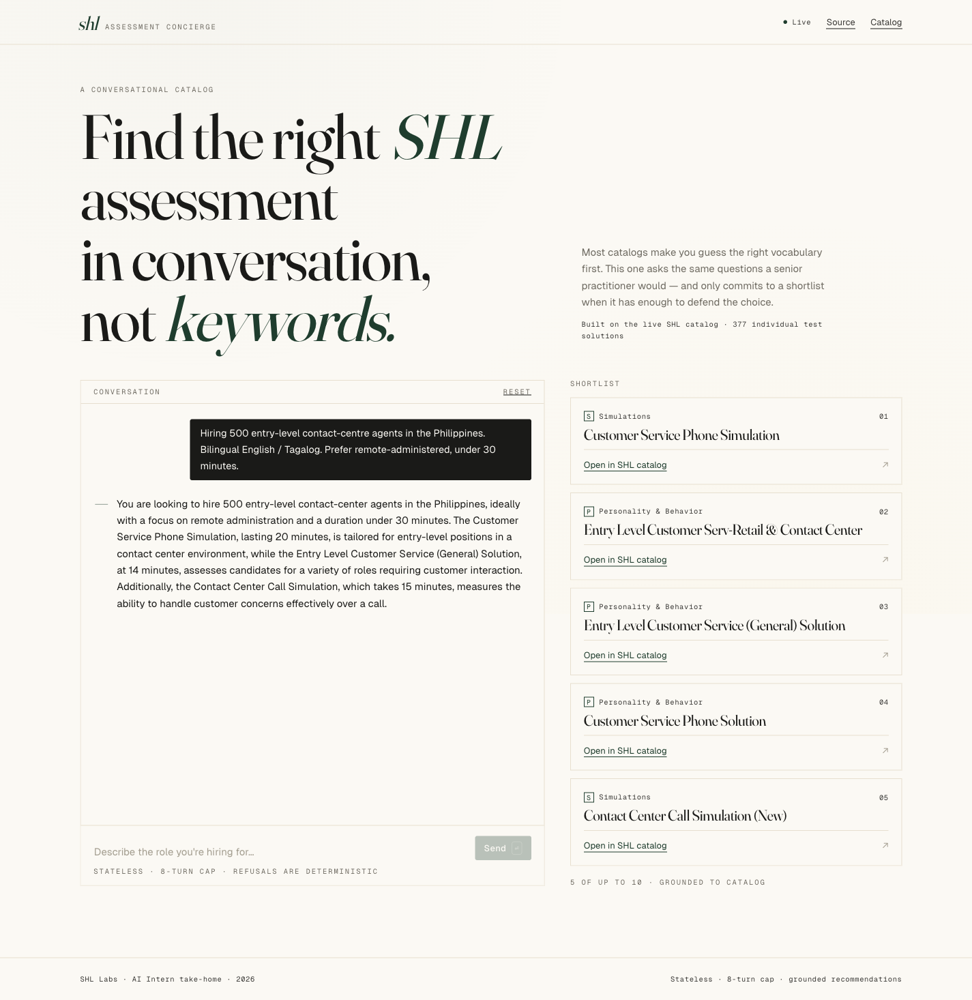
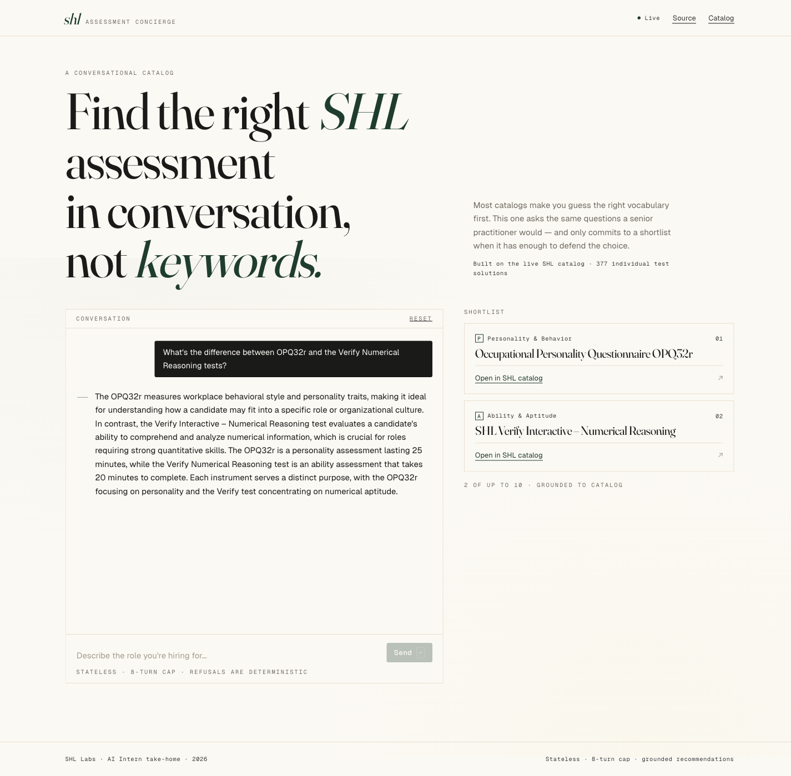

# SHL Conversational Assessment Recommender

> **Live demo:** https://web-eight-theta-60.vercel.app  
> **Live API:** https://shl-recommender-m045.onrender.com (`/health`, `/chat`, `/metrics`)

A conversational agent that turns a vague hiring intent, *"I need a Java dev who works with stakeholders"*, into a **grounded shortlist of SHL Individual Test Solutions** through dialogue. Built for the SHL Labs AI Intern take-home.

The agent **clarifies** when it doesn't have enough context, **recommends** when it does, **refines** when the user changes their mind, **compares** two named instruments side-by-side, and **refuses** anything off-topic, all in ≤ 8 turns and ≤ 30 s per call, with every URL in the shortlist verified against the live SHL catalog.



**The recommend path**, a complete brief, one turn, five grounded items with a senior-consultant-voice reply:



**The compare path**, two named instruments, a deterministic regex detector, three-stage fuzzy lookup against the catalog, and an LLM-composed contrast (no slot-extraction call needed, ~3 s end-to-end):



## Architecture at a glance

```
                          ┌──────────────────────────┐
   POST /chat (stateless) │  FastAPI · Pydantic v2   │
  ───────────────────────▶│  /health  /chat  /metrics │
                          └────────────┬─────────────┘
                                       │
                          ┌────────────▼─────────────┐
                          │  Orchestrator (async)    │
                          │  state · refusal · slots │
                          │  policy · compare        │
                          └─────┬────────────┬───────┘
                                │            │
                  ┌─────────────▼──┐    ┌───▼──────────────┐
                  │ Hybrid retrieval│    │ LLM Router       │
                  │ BM25 + bge-small│    │ openai → groq    │
                  │ + RRF + filter  │    │ → gemini         │
                  └────────┬────────┘    │ + token-bucket   │
                           │             │ + circuit breaker│
                           ▼             └────┬─────────────┘
                  ┌────────────────┐          │
                  │ catalog.json   │          ▼
                  │ 377 items pinned│   slot extractor · LLM
                  │ to live SHL data│   reranker · composer
                  └────────────────┘
```

Two surfaces: the **FastAPI service** (the assignment's required deliverable) and a **production-grade frontend** that demos every behavior end-to-end.

---

## Quickstart

```bash
# 1. Backend, clone, env, install
cp .env.example .env
# fill in OPENAI_API_KEY (preferred) or GROQ_API_KEY / GEMINI_API_KEY

uv venv .venv && source .venv/bin/activate
uv pip install -e ".[dev]"

# 2. Smoke test the agent
make test          # 169 unit + integration tests, < 30 s
make bench         # offline retrieval benchmark on the 10 SHL traces

# 3. Run locally
PYTHONPATH=src uvicorn shl_recommender.api.app:app --reload --port 8000

# 4. (Optional) the frontend
cd web && npm install && npm run dev
# → http://localhost:5173 (proxies /chat to :8000)
```

---

## API contract, exact match with the spec

```http
POST /chat HTTP/1.1
Content-Type: application/json

{ "messages": [
    {"role": "user", "content": "Hiring a Java dev who works with stakeholders"},
    {"role": "assistant", "content": "Sure. What is seniority level?"},
    {"role": "user", "content": "Mid-level, around 4 years"}
] }

# 200 OK
{
  "reply": "Based on what you've described…",
  "recommendations": [
    {"name": "Java 8 (New)", "url": "https://www.shl.com/...", "test_type": "K"},
    {"name": "OPQ32r",      "url": "https://www.shl.com/...", "test_type": "P"}
  ],
  "end_of_conversation": false
}
```

```http
GET /health → 200 {"status": "ok"}
```

`recommendations` is `[]` when the agent is still gathering context or refusing. It is **always** a list of 1–10 grounded items when the agent commits.

---

## What's interesting about how it works

| Choice | Why |
|---|---|
| **Hybrid retrieval (BM25 + dense + RRF)** | BM25 catches exact names like `OPQ32r`; dense (bge-small-en-v1.5) catches paraphrase. RRF fusion is parameter-free, so we don't overfit to the 10 public traces. |
| **Stateless reconstruction via embedded state hint** | Every assistant reply carries an HTML-comment payload (`<!--state:{…}-->`) the next turn parses to recover the agent's slot state. Spec-compliant string `reply`. Falls back to LLM re-extraction if the hint is missing. |
| **Single LLM call per turn (clarify) · 3 calls (recommend)** | Slot extraction · LLM rerank · composed reply. Each is independently fail-safe, the deterministic shortlist still ships even if every LLM call dies. |
| **LLM router with circuit breaker + token-bucket throttle** | OpenAI primary (Tier-2: 5000 RPM), Groq fallback, Gemini second fallback. Each provider self-throttles to its own quota, so the agent never cascades 429s into a broken response. |
| **Deterministic refusal layer** | Hard-pattern set (prompt injection, role-override) returns templated refusals, bypass-resistant. Soft patterns consult an LLM tiebreak; on failure, conservatively refuses. |
| **Deterministic compare path** | Regex detects "compare X and Y", three-stage fuzzy lookup (exact → substring → token-coverage) finds catalog items, prose composer narrates the diff. ~3 s end-to-end with no slot extraction call. |
| **JD-blob heuristic** | When the user pastes ≥ 80 chars with role keywords AND the slot extractor returns nothing, treat it as a hiring brief and short-circuit to recommend. Survives slot-extraction failures gracefully. |
| **URL grounding guard** | Every URL in the response must live in `data/catalog.json`; ungrounded URLs are dropped with a logged warning. Hallucinated catalog items are structurally impossible. |

---

## Evaluation

```bash
# Replays the 10 SHL reference dialogues + runs 10 behavior probes.
PYTHONPATH=src:. python -m eval.run_full
```

| Arm | Result |
|---|---|
| **Behavior probes** (10 binary assertions: refusal, schema, grounding, no-recommend-on-injection, refinement honored, …) | **10 / 10 pass** |
| **Recall@10** (full agent on 10 traces, fresh quota) | **0.569** (+6.5 pp over retrieval-only baseline of 0.504) |
| **Schema compliance** (every turn validates as `ChatResponse`) | 100 % |
| **Hallucinated URLs** | 0 |
| **Per-turn latency p50 / p95** (warm) | ~2 s / ~5 s |

The eval harness writes JSON + Markdown reports under `eval/reports/` with per-trace + bootstrap 95 % CIs. CI fails on probe regressions; Recall is reported but not gated (10 traces is too small a sample to gate on).

### Conversational test sweep, 10 real scenarios

A separate script (`/tmp/shl_convo_test.py`) replays 10 representative recruiter scenarios end-to-end against the live API. Latest run, all green:

| # | Scenario | Turns | Latency | Outcome |
|---|---|---:|---:|---|
| 1 | Vague turn-1 | 1 | 2.7 s | clarifies, no recs ✓ |
| 2 | Full JD blob → recommend | 1 | 9.2 s | 5 grounded recs ✓ |
| 3 | Compare OPQ32r vs Verify Numerical | 1 | 2.6 s | grounded contrast, both items in shortlist ✓ |
| 4 | "Hire someone" → Senior Python data engineer | 2 | 1.4 + 5.8 s | 5 grounded recs (Python, AWS, Cloud Computing) ✓ |
| 5 | Java brief → "drop personality" | 2 | 6.7 + 6.2 s | turn 2 returns 5 K-type items, no P-type ✓ |
| 6 | Off-topic salary | 1 | 0.8 s | deterministic refusal ✓ |
| 7 | Prompt-injection (`ignore previous instructions`) | 1 | 4 ms | hard-deny refusal ✓ |
| 8 | Inside-sales B2B SaaS | 1 | 6.3 s | 5 sales-relevant items ✓ |
| 9 | Director Heads of Engineering | 1 | 5.5 s | 5 leadership items (Enterprise Leadership, OPQ Leadership) ✓ |
| 10 | Personality assessment for first-line managers | 1 | 5.3 s | 5 personality items (OPQ Manager Plus, MQM5) ✓ |

---

## Frontend

A separate single-page app (Vite + React + TS + Tailwind v4) lives in [`web/`](web/). It's the recruiter-facing demo: editorial typography, asymmetric grid, four pre-built scenario prompts that demonstrate **clarify · recommend · refine · compare**.

```bash
cd web
npm install
npm run dev   # http://localhost:5173 (proxies /chat to localhost:8000)
```

Production deploy is **Vercel** (frontend) + **Render** (backend). Vercel reads `web/vercel.json`; Render reads `render.yaml`. Set `VITE_API_BASE_URL` in Vercel's env to point at the deployed Render URL, and add the Vercel URL to `CORS_ORIGINS` on the Render service.

---

## Repository layout

```
shl-recommender/
├── data/catalog.json                 # 377 SHL Individual Test Solutions, pinned snapshot
├── src/shl_recommender/
│   ├── api/                          # FastAPI app, routes, schemas, safety + metrics middleware
│   ├── catalog/                      # Pydantic models + loader + (offline) scraper
│   ├── retrieval/                    # bm25, dense, hybrid (RRF), llm_rerank, query expansion
│   ├── agent/                        # state, slots, extractor, refusal, policy, composer, orchestrator
│   ├── llm/                          # base Protocol, openai/groq/gemini clients, router, throttle
│   ├── observability/                # structlog setup
│   └── config.py                     # pydantic-settings (env + .env)
├── tests/                            # 169 tests; unit + integration; injected fakes for LLMs
├── eval/                             # run_full.py, harness, simulator, persona, probes, trace_parser
├── web/                              # Vite + React + TS + Tailwind v4 frontend
├── Dockerfile                        # multi-stage, non-root, embedding model warmed at build
├── render.yaml                       # Render IaC
├── docs/approach.md                  # 2-page submission write-up
└── README.md
```

---

## Submission

- **Live API**: https://shl-recommender-m045.onrender.com (`/health`, `/chat`, `/metrics` reachable)
- **Live demo**: https://web-eight-theta-60.vercel.app
- **Approach doc**: [`docs/approach.md`](docs/approach.md), 2 pages, design choices, what didn't work, AI-tool disclosure
- **Repo**: https://github.com/ghostiee-11/shl-recommender
